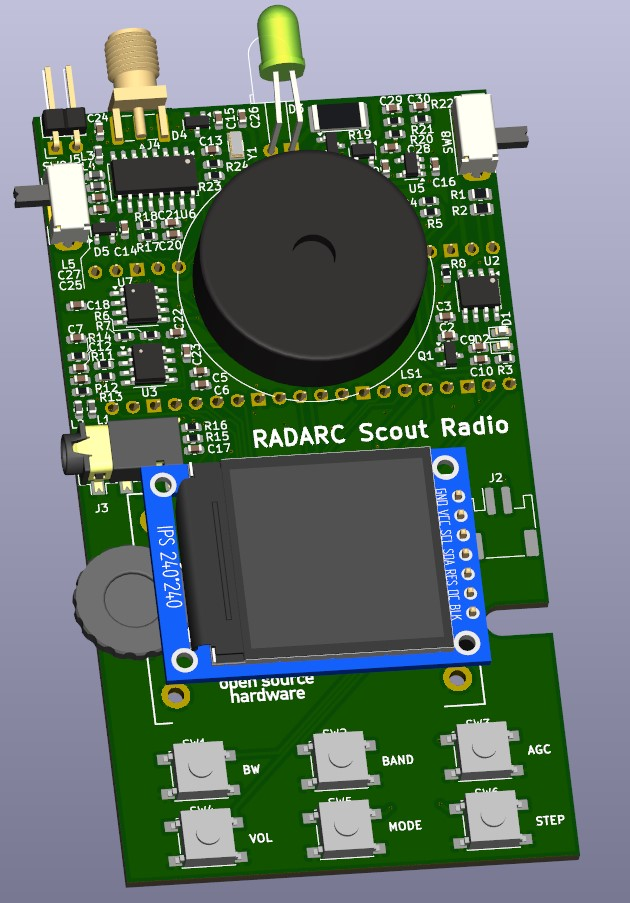
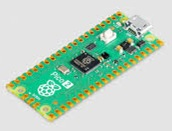
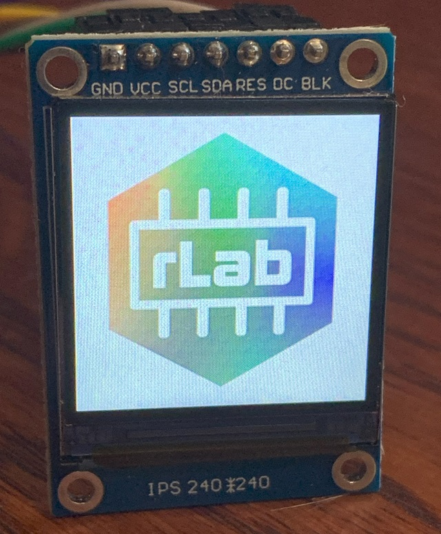

# Scout-Radio
Si4732 and Raspberry Pi Pico Radio device for Scouts to build and use to gain badges

Reading and District Amateur Radio Club works withl local Scouts groups and help them in support of their badges and activities

## Objectives:
<ul>
<li>Design and build a radio device with can support Scouts in the following badges
<ul>
<li>[Electronics](https://www.scouts.org.uk/scouts/activity-badges/electronics/)</li>
<li>[Communicator](https://www.scouts.org.uk/scouts/activity-badges/communicator/)</li>
</ul>
<li>Involve Scouts in radio activities</li>
<li>Potential Sponsorship and incresaed local community technology support for Scouts</li>
<li>Interesting Project for RADARC Constructors</li>
<li>Have Fun!</li>
</ul>

## Design Specification
Derived from the RLab Reading Hackspace [Project Athena](https://github.com/reading-hackspace/project-athena)
<ul>
<li>Microprocessor design based on Raspberry Pi Pico Microcontroller</li>
<li>Programmable firmware in CircuitPython and other programming languages via USB</li>
<li>On Board AM and FM Radio</li>
<li>Loudspeaker and audio output</li>
<li>Rotary Encoder and control buttons</li>
<li>Battery powered 3 off AAA, or LiPo with on board charger from USB</li>
<li>Audio output jack</li>
<li>Mixture of surface mount and through hole components. Some components can be factory assembled</li>
<li>Colour LCD display integral</li> 
<li>Optional GPS module</li>
<li>Optional Compass module</li>
<li>Low Cost, under £20</li>
</ul>

## Proposed Design
The following elements are in the prototype design, being commonly available at reasonable cost. Some of these may not be in the final design or optional modules to save cost:

### Raspberry Pi Pico Processor Module

The Raspberry Pi Pico module is based on the RP2040 microprocessor. The module includes flash memory, power supply, crystal clock and a USB interface. It is an easy way to to integrate this processor without detail PCB layout and at attractive cost.
The Pi Pico Module have different variants which are pin compatible. They offer different USB Connectors(Micro-B, USB-C), Wireless and bluetooth integrated, and a higher performance version in the RP2350.
[Pi Pico Data sheet](https://datasheets.raspberrypi.com/pico/pico-datasheet.pdf)

The RP2040 is an ARM Cortex M0+ 32 bit processor which operates at 133MHz and includes a wide range of integrated peripherals.
[RP2040 Data sheet](https://datasheets.raspberrypi.com/rp2040/rp2040-datasheet.pdf)

High quality software support for the RP2040 and Pi Pico Modules is available in C/C++ ([C SDK](https://www.raspberrypi.com/documentation/microcontrollers/c_sdk.html), and [Arduino Pi Pico](https://www.tomshardware.com/how-to/program-raspberry-pi-pico-with-arduino-ide)), and Python([Micropython](https://www.raspberrypi.com/documentation/microcontrollers/micropython.html), and [CircuitPython](https://circuitpython.org/board/raspberry_pi_pico/))

### SiLabs Si4732 AM/FM radio
[Datasheet](https://www.skyworksinc.com/-/media/Skyworks/SL/documents/public/data-shorts/Si4732-A10-short.pdf)

The Si4732 is an integrated AM/FM radio device which is digitally programmable over I2C.
It covers a range of frequencies:
<ul> 
<li>Worldwide FM band support (64–108 MHz) </li>
<li>Worldwide AM band support (520–1710 kHz)</li>
<li>SW band support (2.3–26.1 MHz)</li>
<li>LW band support (153–279 kHz)</li>
</ul>
The radio also supports FM stereo and RDS.
Software patches are available for the device to support SSB and NBFM

### Rotary Encoder and push button controls

A side operated rotary encoder is installed on the prototype, but we might look at lower cost alternatives. There are 6 tactile push button switches which can be used to invoke the various radio functions. These controls can also be used to play simple nintendo like games on the radio.

### Audio Output
The stereo audio audio output from the radio chip is amplified to provide an output to headphones of external speakers. This is then further amplified to drive an on board loudspeaker.
The output from the radio chip is also fed to the ADC inputs on the Pi Pico to enable the Pi Pico to provide USB or Bluetooth feed to an external program such as WSJT-X. The Pi Pico may be able to decode locally digital protocols such as FT8 and display locally.
The Pi Pico also provides a PWM audio output for beeps and music for simple games.

### 1.3 inch IPS Colour LCD Display

A colour LCD display was chosen for the device. Limited space allows for a [240 by 240 pixel 1.3 inch IPS display](https://www.smart-prototyping.com/1_3-inch-TFT-IPS-Display-Module-ST7789-SPI-240-240).
The module is based on the ST7789 display IC and is supported by both Micropython and CircuitPython grahics libraries.

##   Estimated Costs

## PCB Files

## Software

